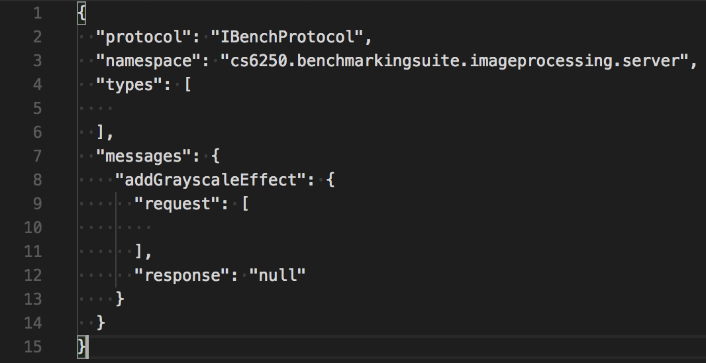

# Profiling and Benchmarking Computational Offloading

**THIS IS A SUBMODULE PROJECT ONLY, DO NOT CLONE DIRECTLY**
Go to [Parent Project](https://github.com/farzonl/cs6250-server) for installation a dependency instrutions.

## Code Status

## Demo
<object width="560" height="315" data="https://www.youtube.com/embed/2qbBWnnJzZo" frameborder="0" allow="accelerometer; autoplay; encrypted-media; gyroscope; picture-in-picture" allowfullscreen>

Github does not support embedded youtube. <a href="https://youtu.be/2qbBWnnJzZo"> Click here to view</a>.

</object>

Abstract
========

Mobile devices are ubiquitous and resource constrained. However, users
need an exceptional experience despite these constraints. To provide
such an experience, we are looking to exploit the plentiful resources
available in the cloud.This project hopes to solve this problem with a
remote processing strategy known as cloud offloading. Many benchmarks
were made that take pictures of a scene but allow an offsite server to
do the image processing and then send the resulting image back to the
device on which the images were captured. The essence of this project is
to strategize offloading for different applications to enhance user
experience.

Introduction
============

Today everyone has a mobile device but these devices remain
computationally constrained compared to laptops, desktops, servers, and
super computers. Other limitations include battery, heat, memory, and
threading limiting the potential for code optimization on device with
current general purpose CPUs. Despite all of this users still demand and
exceptional experience when using a mobile application. Increasing the
applications that consume most of users time are photo and video
manipulation apps like Snapchat and Instagram. The future likely holds
more applications in the computer vision, graphics, and augmented
reality space. Our solution to these pressing constraints on what can be
done with on device resources and what is expected to be done is to look
towards the cloud as computational accelerator. In this paper we present
a benchmarking application we built to analyze which problem sets are
best to be offloaded and what optimization techniques we can use to
improve speed and bandwidth.

Motivation
==========

Computational offloading is a broad problem where depending on the goal
you want to optimize for will result in different outcomes. Much of the
focus in the literature today seeks to find answers for performance
improvements, extending battery life, optimizing for Heat and power
constraints (typically classified under the dark silicon problem),
computational partitioning where you divide computation between the
device and the cloud, and much more. We itemize the interesting areas of
research below.

-   *Performance*: This is where much of the research we found
    interesting for our project lies. Essentially here we identify Where
    we can improve efficiency by offloading suitable algorithms to the
    cloud. We will do a literature review on this area in the background
    section of this paper.

-   *Battery Life*: Offloading might help us save battery on the mobile
    system. For an application like ours we would expect the screen and
    camera to be constantly running which we could treat as constant
    power draw. experimentation could be cpu utilization vs wifi or
    modem power draw. Experimentation could further be done around
    distance from a cell tower or wifi access point as a way of varying
    any heuristic we derive for determining whether or not to offload.
    [@wifiBattery]

-   *Computation Partitioning*: It is possible to partition an
    application to use both the cloud and local resources
    simultaneously.[@partitioning]

-   *Dark Silicon*: Most of the research around Dark silicon in mobile
    has been focused around coming up with new architectures like ARM
    big.LITTLE and the experimental GreenDroid. These are all solutions
    to try and overcome *Dennard scaling* which states that as as
    transistors get smaller their energy density stays constant since
    voltage and current in the transistor scale downward as well.
    [@darkSilicon] GreenDroid is particularly interesting because they
    are creating an on-chip network router as a way of distributing
    processing across the die to minimize heat by utilizing as much
    surface area as possible. [@greenDroid] Given they are already using
    distributive computing concepts to solve this problem it would not
    be too far fetch to think that if current chip design improvements
    fail to fully address this area, off device computation could be a
    path forward.

-   *Server Availability*: This topic attempts to address the question
    can you offload if your server is unreliable? If the cloud might not
    always be available for offloading can we gather a metric for the
    quality of the network? How much do we consider qualitative metrics
    like diminishing user experience?

-   *Decision Overhead*: There is an an overhead that needs to be
    consider when we periodically tests the network quality and makes
    dynamic decisions for offloading. The iPerf network profiling
    processing periods would routinely be one of our most high profile
    threading events in our Traceview dumps. These were done
    asynchronously so it did not show up in performance metrics but
    could have implications for some of the other goals to consider for
    this research topic like partitioning, and battery life.

Lack of a budget for this project made battery life and power
experimentation impossible as all of our testing were done on emulated
android devices. We chose to focus instead on performance optimization
and simulate 3G, 4G, and Wifi networks. The Server Availability and
Decision overhead head questions required us to first build out a
platform before we could make any progress on addressing these
questions, so for scoping we do not address them in this paper. We
should note that the literature around using computational offloading to
solve the dark silicon problem is slim to none and could be an
interesting focus of research. Since we will be focusing on performance
we will try to constrain the problem sets we will try to improve to:

-   Image/Video processing applications

-   Augmented Reality (AR) applications

Background
==========

The basic idea of Computational offloading as laid out by *Shi and Ammar
COSMOS (Computation Offloading as a Service for Mobile Devices)* is to
have a client component and a server component that can run the same
code.[@cosmos] The client component needs to perform 3 basics functions.
First, monitor and predict network performance. Second, track execution
requirements Third, choose some portion of code to execute remotely that
can reduce computation time. Our implementation and paper will deviate
from COSMOS in a few significant ways, for one we have no hardware or
budget for on demand VM allocation. Or performance improvements will be
limited to that of a single laptop server. Second, our platform is a
benchmark suite similar to something like spec2000, So we want to answer
the question of what types of problems are good to offload and what are
not. COSMOS on the other hand is better suited for problems where you
know what you want to offload. COSMOS also had a metric of cost it
wanted to optimize for. This is a requirement we are ignoring for this
paper, and is not as relevant for us as we do not lease computation time
for our experiments.

Another research paper, CloneCloud [@clonecloud] by Chun and Ihm focuses
on dynamically offloading only a part of the execution from the mobile
devices to the cloud. CloneCloud was far more focused on taking any
application and running it through a static analyzer to determine what
improvements could be done for offloading. Our paper will try to pick a
more constrained problem set to work with. Our paper will focuses on the
offloading experimentation around image processing applications. We
chose to focus only on the image processing applications.

Decision Engine
---------------

The COSMOS system achieves high performance offloading at a low cost by
sharing cloud resources among the mobile devices. An optimization
algorithm was proposed by the authors to determine the cloud resource
management, the decision to offload and the task allocation, based on
the assumption that the cloud can simultaneously run N virtual machine
instances. [@cosmos]

The maximum speedup of using the COSMOS system against the local
execution can be computed by solving the optimization algorithm.

  K                   Total computation tasks
  ------------------- ------------------------------------------------------------
  M$_{i}$             The type of the i$^{th}$ VM instance
  T$_{i}$             The leasing periods of the i$^{th}$ VM instance
  $\psi$(M,T)         The pricing function for leasing a VM instance
  O$_{k}$             The k$^{th}$ computation task
  I(i,k)              The indicator function for offloading task O$_{k}$ to VM i
  I$_{l}$(k)          The indicator function for executing task O$_{k}$ locally
  L(O$_{k}$)          The local execution time of the task O$_{k}$
  R$_{i}$ (O$_{k}$)   The response time of offloading the task O$_{k}$ to VM i

$$Max  \space \sum_{k = 1}^{K} \frac{L({O_{k}})}{\min_{ \frac{L({O_{k}})}{I_l(k)}, \frac{R_i({O_{k}})}{I(i,k)} |\forall_{i}}}$$
$$s.t. \space I_{t}(k) +\sum_{t = 1}^{N} I(i,k) = 1$$

In the COSMOS decision engine, to decide whether to offload or not
depends on setting the Il(k) to 0 or 1. This is a challenge because of
various network connectivity, program execution and resource contention
issues. These uncertainties have to be dealt with for proper utilization
of cloud resources and optimized speedup. [@cosmos]

For our uses we can drop variables T$_{i}$ and $\psi$(M,T) because cost
is not a concern of this paper. Further we will be redefining L(O$_{k}$)
as T$_{computation\_device}$ and R$_{i}$ (O$_{k}$) as
T$_{total\_server}$. We will further simplify our algorithm from being
the sum of all compute tasks to each individual task as our heuristic
will be highly specialized for the effect we want to optimize. For
example the indicator for grayscale would likely be I$_{l}$(k) \> .95
while one for something like Face swap would take more network health
into consideration and thus I(i,k) would be larger. More on this in
*Simplified Dynamic Offloading Decision Engine* section.

Design
======

Objective
---------

Create a video editor that allows different effects to be applied to the
video, such as gray scale, blurring, negative, Face Swap, etc. The video
should be captured directly from the camera. The editor should also have
a well usable UI to apply any effects or editing features. The UI should
consider best practices for an application that targets phone or tablet
form-factors. Finally, the application is expected to have good
programmatic design and well-documented function or method calls to
allow for reproducibility of results by an impartial red team.

Core Android (Anchored Code)
----------------------------

Design patterns make up a big part of enabling whether or not an
application can be offloaded. We took best practices from *Refactoring
Android Java Code for On-Demand Computation Offloading*. The most
important way that we enable this is through pipelineing our effects. We
need to be able to categorize our codebase into *Anchored* and
*Moveable* class. Effects have no dependency on Android code and the
camera image fetches are abstracted to the beginning of the pipeline and
have no barring on later section of the pipeline. [@AndroidRefactor]

Effects (Moveable Code)
-----------------------

### Definitions

Below you will find a list of effects we implemented for this project

-   *Blur*

-   *Circle Detection*

-   *Color Saturation*

-   *Drawing*

-   *Edge Detection*

-   *Gradient Magnitude*

-   *Gray Scale*

-   *Horizontal Flip*

-   *Line Detection*

-   *Motion History*

-   *Negative*

-   *Sepia*

-   *Vertical Flip*

-   *Object Detection*

-   *Cartoon*

-   *Face Detection*

-   *Face Landmark Detection*

-   *Mask*

-   *Face Swap*

### Example of Effects

The effects we chose covered a broad set of Image processing
requirements.

-   Image Processing

      ------------------------- ------------------------- -----------------------------
              
      Original                          Grayscale                               Cartoon
      ------------------------- ------------------------- -----------------------------

-   Artificial Intelligence

      ------------------------------- ------------------------------------
           
      Object Detection                              Face Feature Detection
      ------------------------------- ------------------------------------

-   Augmented Reality

      ----------------------------- -------------------------- ------------------------
              
      Face Landmark Detection                  Mask                           Face Swap
      ----------------------------- -------------------------- ------------------------

Implementation
==============

Our project is a testing framework to measure the practicality of
offloading these image processing jobs to a remote server. We do this
with an Android application and Java server such that the Java code can
be written once and run anywhere. Both of these programs are capable of
applying these effects whether or not the choice to offload has been
enabled. Our experimentation will be to use a suite of image effects to
measure the efficiency of offloading.

Client Side
-----------

We built and image manipulation application that acts as a benchmark
suite for common computation problems performed by those in the Computer
Vision, Augmented Reality, Artificial Intelligence, and Computer
graphics space. We apply multiple filters including some that use neural
nets using OpenCV and Dlib. The Effects themselves were written entirely
in Java and thus could be shared with the server side. The Effects
classes are inspired by functional programming, they have no global
dependencies and perform their effects without causing any side effects.
They take in one input matrix perform and action and return an output
matrix. This makes these effects good candidates to take advantage of
pipeline parallelism.

For this project we tried to distinguish ourselves by working with real
time data that we get straight from the camera. The effects we have
chose make up a range of high, to low computationally complex problem
sets. We also implemented a set of compression optimization's on the
client to reduce the number of bits we send.

Server Side
-----------

To facilitate the ease of offloading, we use the Apache Avro Interface
Description Language, which runs on top of the non-blocking Netty HTTP
Web Server. This IDL is written in a language independent form which is
then serialized into JSON and compiled into dependency-free Java.

Some benefits of this interface are that we can ship
platform-independent code to the client and server which requires no
state or previous interaction to complete a task. The compiled Java code
is a loose interface which abstracts device dependant implementations.
Because each task is modeled as a function call, the profiling tools we
use can simply watch the call stack to measure elapsed times, and the
Java runtime can take care of any native code discrepancies.

### Details of Offloading

We use Apache Avro to generate the Interface which will be used to
implement the offloading framework. An example of an offloadable method,
its corresponding AIDL signature and the generated Interface method are
given in figure below.

  ---------------------------------------------------------------------------------- ---------------------------------------------------------------------------------------
       
  ---------------------------------------------------------------------------------- ---------------------------------------------------------------------------------------

To write RPC signatures in AIDL like in the above figure we manually
identify which methods can be offloaded. We covered a broad range of
algorithms that both should and should not be good at offloading. With
profiling we can come up with a minimization subset that we may find
suitable for offloading. We need to define some qualitative and
quantitative heuristics for offloading. The qualities of methods the
literature suggest are suitable for offloading are:

-   *clean signature* Don't pass around global memory all data passed in
    or out should be serializable

-   *large execution times* Significant chunk of computation required

-   *System resource independence* Should not require OS or system
    specific hardware solved with wrappers and interfaces) Examples
    include camera, storage, and OS specific APIs.

-   *Parallelizable* If a method performs a computation which is much
    more optimally implemented in the cloud, for example, GPGPU
    computations, we can choose to offload such a method. For our uses
    linear algebra and matrices are a very parallelizable problem space.

-   *No native code dependence* The literature encourages the use of VM
    only code. This is not something we had the luxury of doing, as both
    Dlib and OpenCV are native libraries. We get close though by using
    existing and writing our own JNI wrappers.

Profiling
=========

Everything we have presented so far has been for the sake of answering
the one important question of when should we offload? Using Android's
Traceview and iPerf we hope to answer this question.

Traceview
---------

We use Android Traceview to help us determine which Effects are good
candidates to offload. Traceview is an android tool used for profiling
an applications performance and produces execution trace logs with per
method execution times that we can comb over with out own scripts. It
gives us detailed view of the execution times of a method as well as
their call stacks. Using a Traceview profile, we can build up a
heuristic to determine offload candidates.

iPerf3
------

Traceview above let us know either the time to run on device or the time
to run on the server plus communication time. However, this alone is not
enough information to determine if we should offload For this we need
iPerf3, a bandwidth measurement tool. We ported iPerf3 to android and
then began measuring the available bandwidth for our app and the health
of our network. With the information provided by iPerf and Traceview we
can finally do something smart, like dynamic offloading.

Experimentation
===============

Method
------

We evaluated our project across three different simulated mobile
networking scenarios:

-   **WiFi** a connection over enterprise-grade 802.11 wireless access
    point between our RPC server on one machine and an emulator on
    another.

-   **3G** Here we rate limit the emulators network speeds to that of a
    3G modem.

-   **4G** Here we rate limit the emulators network speed to that of a
    4G modem.

For a baseline we measured the on-device computation of each image
effect defined in the effects section of this paper.Then for each of the
scenarios listed above we calculated the performance of each effect when
offloaded. We also wanted to experiment with compression optimizations.
So we had a test looking for both the fastest and most reduced sized
payload. The best algorithm was then run across the full set of effects
to evaluate performance. Each run had both iPerf as well as Traceview
runs. This generated server and client side iPerf files as well as one
trace dump file that we evaluated for performance metrics.

To reduce variability among results we all used an x86 QEMU emulated
Pixel android phone running Android 8 Oreo.

Next, we decided to run the results on different network link speeds.
This is because mobile applications today run applications on both
cellular data at 3G or 4G/LTE speeds as well as on WiFi. The experiments
were conducted by limiting the emulator network rates to match the real
world data rates as closely as possible.

The Traceview data was collected for all effects initially to determine
the CPU usage for each effect on device and on server. Next, the iPerf
logs were used to determine the network utilization during offloading.
So, the idea was to use the data from Traceview and iPerf to determine
the CPU and network utilization for different types of effects.

The compression bandwidths vs Time Figures show that the gzip and bzip2
offer the best maintenance of bandwidth when the effect type was held
constant across multiple network types. The two anomalous data entries
in the Face Landmark and Face Swap in the Time to Compute graph were
likely caused by invocation of the android dynamic loader for the dLib
module.

Results
-------

Future Work
===========

Simplified Dynamic Offloading Decision Engine
---------------------------------------------

The decision engine we have experimented with but need more data to
complete is based on the following:

-   bandwidth to the server

-   computation time on the server

-   computation time locally

We need to determine what our communication costs will be for this we
will define the following formula for time to communicate. (Note we
multiply by 2 to account for sends and receives.)
$$T_{total\_communication} = 2 * \frac{Size_{image}}{bandwidth}$$

We can estimate the amount of time taken to process the image on the
server when offloaded as follows:

$$T_{total\_server} = T_{total\_communication} + T_{computation\_server}$$

To determine what are good candidates for offloading we need to
statically compute the average amount of time required to apply an
effect to an image both on the server (*T$_{computation\_server}$*) and
on the local device (*T$_{computation\_device}$*). This is where our
Traceview Runs come in handy.

If T$_{computation\_server}$ is less than T$_{computation\_device}$ then
we have a candidate for offloading. But as mentioned above in the iPerf
section that is not enough data. We start with a fuzzed value of 100 ms
to represent communication costs at first until we can update with a
more accurate number representing the current state of the network. If
T$_{total\_server}$ is greater than T$_{comp\_dev}$, it means that it is
more efficient to do the computation locally than offloading. This
decision is taken dynamically. Using the information surmised above we
can use the following heuristic (equation 3) to determine when to
offload. $$T_{computation\_device} > T_{total\_server}$$

Video Codec Optimizations
-------------------------

The project can be extended to work with live video streams, to process
these video streams on device or on cloud. Video streams carry large
amounts of data. Consider a 480p video stream at 30 frames per second
with 24 bits per pixel (colored video). It generates data at the rate of
221 Mbps. It is not plausible to support such large data rates on
today's internet. Hence compression is crucial. [@codec]

Video streams can be broken down into frames where each frame is
essentially an image. A video stream can be compressed spatially and
temporally. Spatial video compression is when each frame is compressed
individually and temporal compression is when frames are compressed in
time. Temporal compression exploits the fact that pixels do not change
drastically across each frame. [@codec]

Spatial compression uses JPEG (Joint Photographic Experts Group) for
compressing each frame. JPEG uses DCT (Discrete Cosine Transform)
encoding with quantization to achieve compression. Another aspect is
using YUV and chroma subsampling. Using chroma subsampling, we can send
color data at half the resolution. This is because human eye cannot
detect changes in color as sharply as changes in brightness. [@codec]

However, in high motion frames,it is more important to send more number
of frames than maintaining the resolution of each frame. Hence, a new
macroblock encoding technique can be used, \"Flat\", to reduce the bits
needed for each frame. Flat format is:

6 bits - for each color channel quantized by 4 [@codec]

DCT and quantization is done to reduce the coefficient values to zero to
save bandwidth. However, what is more important is getting the
consecutive coefficients to zero so that we can use RLE (Run Length
Encoding) to actually reduce the number of bits to be sent. [@codec]

For this, we need to focus on the entropy coding. JPEG uses Huffman
coder to reduce the number of bits sent for coefficients closer to zero.
An artithmetic coder like RANS can aslo be used to save bandwidth.
[@codec]

Conclusion
==========

In the paper, we have implemented a testing framework to measure the
practicality of offloading image processing jobs to a remote server. The
experimental results show that our system enables computation offloading
at low cost and high efficiency. We have noticed the best offloading
performance in our ML based algorithms like face swap, Even when
accounting for the additional performance cost at start up of shared
library loading we still see reliable performance improvements.

There are some future directions to extend our testing framework. We
need more data to complete bandwidth to the server, computation time on
the server and computation time locally for simplified dynamic
offloading decision engine. The project can be extended to work with
live video streams, to process these video streams on device or on
cloud.

2

Cong Shi, Karim Habak, Pranesh Pandurangan,Mostafa Ammar, Mayur Naik,
Ellen Zegura *COSMOS: Computation Offloading as a Service for
MobileDevices*.

Byung-Gon Chun, Sunghwan Ihm, Petros Maniatis, Mayur Naik, Ashwin Patti
*CloneCloud: Elastic Execution between Mobile Device and Cloud*.

Ning Ding Daniel Wagner Xiaomeng Chen Abhinav Pathak Y. Charlie Hu
Andrew Rice *Characterizing and Modeling the Impact of Wireless Signal
Strength on Smartphone Battery Drain*.

Max Menges *Dark Silicon and its Implications for Future Processor
Design*

Jianqiang Li, Luxiang Huang, Yaoming Zhou, Suiqiang He, and Zhong Ming
*Computation Partitioning for Mobile Cloud Computing in a Big Data
Environment*

Nathan Goulding, Jack Sampson, Ganesh Venkatesh, Saturnino Garcia, Joe
Auricchio, Jonathan Babb, Michael B. Taylor, and Steven Swanson
*GreenDroid: A Mobile Application Processor for a Future of Dark
Silicon*

<http://docs.opencv.org/doc/tutorials/imgproc/imgtrans/hough_lines/hough_lines.html>

<http://www.aishack.in/2010/04/hough-transform-in-opencv/>

<http://docs.opencv.org/doc/tutorials/imgproc/imgtrans/sobel_derivatives/sobel_derivatives.html>

<http://docs.opencv.org/doc/tutorials/imgproc/imgtrans/canny_detector/canny_detector.html>

Ying Zhang, Gang Huang , Xuanzhe Liu , Wei Zhang, Hong Mei, Shunxiang
Yang *Refactoring Android Java Code for On-Demand Computation
Offloading*

Ben Garney
*https://bengarney.com/2016/06/25/video-conference-part-2-joint-photographic-hell-for-beginners/
Video Conference: Joint Photographic Hell (For Beginners)*
